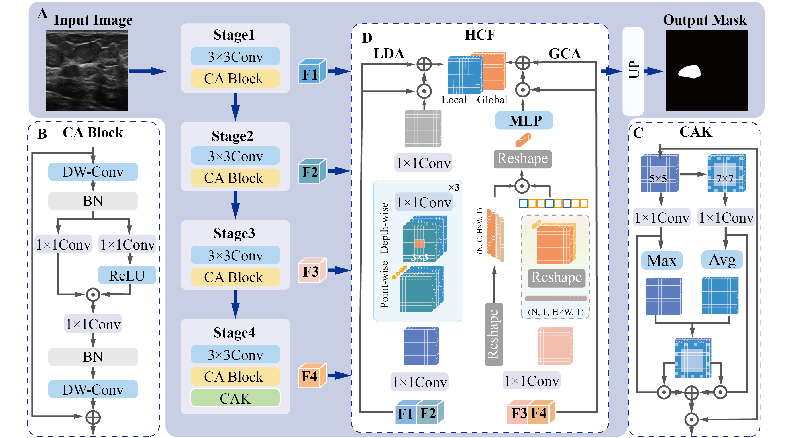
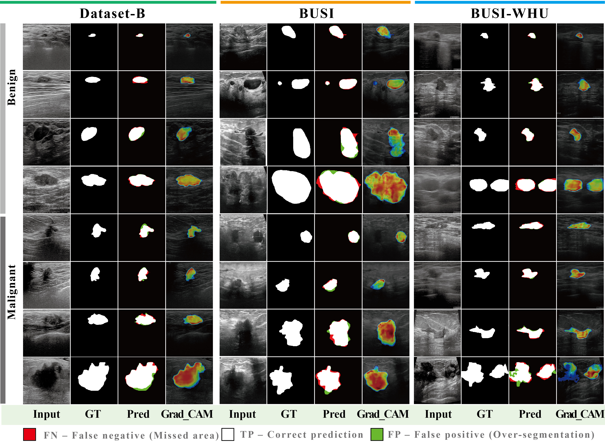
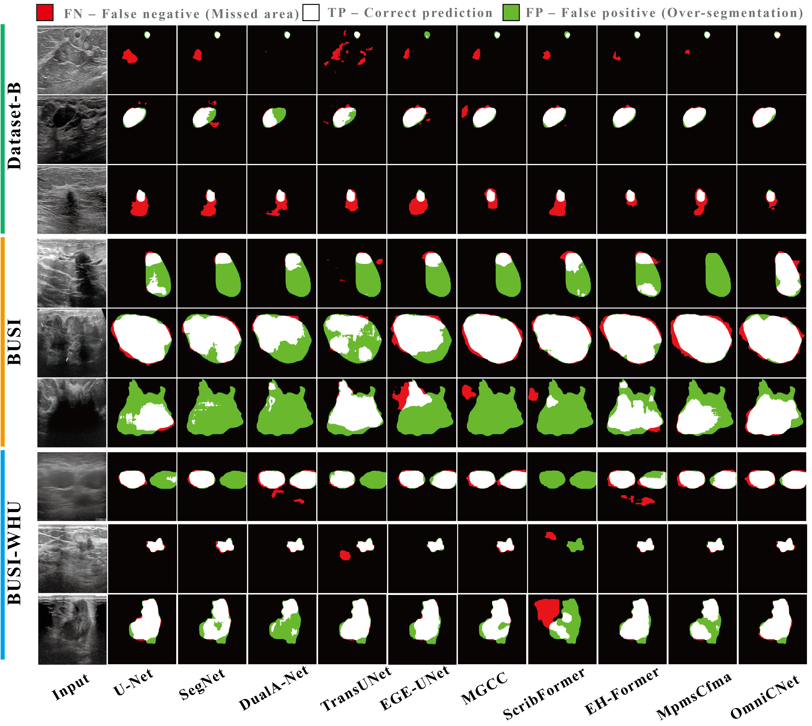
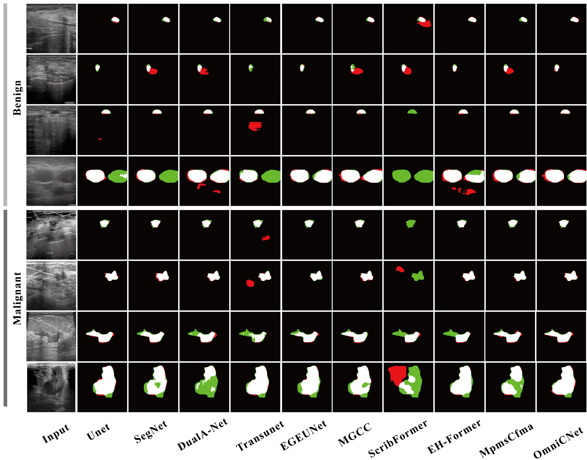

<h1 align="center">
  OmniCNet
</h1>

<p align="center">
  
  <br>
  <rm>Figure 1: OmniCNet Architecture</rm>
</p>

**📖Title：** OmniCNet: Orchestrating Omni-Scale Contextual Representations for Breast Ultrasound Image Segmentation

**👨‍💻Author：** **Jin Huang<sup>1</sup>†**,  **Shengqian Wang<sup>2</sup>†**,  **Yimin Zhang<sup>3</sup>†**,  **Du Wang<sup>1</sup>**,  **Liye Mei<sup>1,4,*</sup>**, **Cheng Lei<sup>1,5,*</sup>**
Corresponding Authors  📧 **liyemei@whu.edu.cn**   📧 **leicheng@whu.edu.cn**

Affiliations

- <sup>1</sup> School of Integrated Circuits, Wuhan University, Wuhan 430072, China  
- <sup>2</sup> School of Robotics, Wuhan University, Wuhan 430072, China  
- <sup>3</sup> Department of Breast and Thyroid Surgery, Renmin Hospital of Wuhan University, Wuhan 430060, China  
- <sup>4</sup> School of Computer Science, Hubei University of Technology, Wuhan 430068, China  
- <sup>5</sup> Shenzhen Institute of Wuhan University, Shenzhen 518057, China  


**Link：** [](https://github.com/huangjin520/OmniCNet) []() [](https://www.lei-whu.com)


**📜Abstract:** <p align="justify"> Breast ultrasound image segmentation is crucial for computer-aided diagnosis but remains difficult due to speckle noise, blurred boundaries, and tumor heterogeneity. Existing CNNs struggle with long-range context, while Transformers often lose spatial precision. Although recent hybrid models that combine CNNs and Transformers attempt to leverage both local and global features, they often fail to effectively coordinate semantic and spatial information across multiple scales. We propose OmniCNet, a novel framework that orchestrates omni-scale contextual representations by coordinating semantic and spatial features across multiple resolutions and depths. This unified modeling approach enables the network to preserve fine lesion details while capturing global context, leading to accurate and robust segmentation. Experiments on three benchmarks show that OmniCNet outperforms state-of-the-art methods, demonstrating strong clinical potential. Code is available at https://github.com/huangjin520/OmniCNet.


# Introduction
This is an official implementation of [OmniCNet: Orchestrating Omni-Scale Contextual Representations for Breast Ultrasound Image Segmentation](). ...


## 🚀 Quick start
### 1️⃣ Installation
Assuming that you have installed PyTorch and TorchVision, if not, please follow the [officiall instruction](https://pytorch.org/) to install them firstly. 
Intall the dependencies using cmd:

``` sh
python -m pip install -r requirements.txt --user -q
```

All experiments use the PyTorch 1.8 framework in a Python 3.10 environment. Other versions of pytorch and Python are not fully tested.
### 📂 Data preparation
We have evaluated segmentation performance on three public datasets:
 [Dataset B](https://ieeexplore.ieee.org/abstract/document/8003418)
 [BUSI](https://www.sciencedirect.com/science/article/pii/S2352340919312181), 
 [BUSI-WHU](https://data.mendeley.com/datasets/k6cpmwybk3/3). 
 Please prepare the data as following:

📂 DATASET  
└── 📂 BUSI-WHU  
&emsp; ├── 📂 train  
&emsp; │ &emsp; ├── 🖼️ img  
&emsp; │ &emsp; └── 🎯 mask  
&emsp; ├── 📂 val  
&emsp; │ &emsp; ├── 🖼️ img  
&emsp; │ &emsp; └── 🎯 mask  
&emsp; └── 📂 test  
&emsp; &emsp; ├── 🖼️ img  
&emsp; &emsp; └── 🎯 mask


### Training
The OmniCNet model can be trained on BUSI-WHU training set using the following: 

```
python train_BUSI_WHU.py 
``` 

The parameters of the model have been carefully designed. 

OmniCNet - Hardware: an NVIDIA RTX 3090 GPU and an Intel Core i9-10900X CPU.


## 📊 Evaluation
The OmniCNet model can be evaluated on BUSI-WHU validation set using the following: 

```
python eval.py 
``` 
<p align="center">
  
  <br>
  <rm> Figure: OmniCNet performance on the Dataset B, BUSI and BUSI-WHU datasets. In Pred columns, red (FP) and green (FN). In Pred columns, blue (GT) and green (prediction mask). </rm>
</p>

**Table**: Quantitative comparison (Mean ± SD) across Dataset-B, BUSI, and BUSI-WHU.  Best results are **bolded**, second-best are <u>underlined</u>, and * indicates p < 0.05 vs. ours.  ↑: higher is better, ↓: lower is better.  

| Method | Dataset-B mIoU (%) ↑ | Dataset-B ASSD ↓ | BUSI mIoU (%) ↑ | BUSI ASSD ↓ | BUSI-WHU mIoU (%) ↑ | BUSI-WHU ASSD ↓ |
|--------|----------------------|------------------|-----------------|--------------|---------------------|-----------------|
| U-Net<sub>2015</sub> | 88.30 ± 3.90* | 6.51 ± 2.33* | 86.65 ± 5.23* | 7.76 ± 1.57* | 89.09 ± 0.88* | 4.54 ± 0.77* |
| SegNet<sub>2017</sub> | 84.49 ± 5.20* | 10.69 ± 3.17* | 84.51 ± 4.33* | 7.78 ± 4.77* | 89.29 ± 0.81* | 3.51 ± 0.47* |
| DualA-Net<sub>2021</sub> | 87.67 ± 2.57* | <u>3.80 ± 1.11*</u> | 85.87 ± 5.78* | <u>4.31 ± 3.25*</u> | <u>90.29 ± 0.50*</u> | 3.78 ± 0.72* |
| TransUNet<sub>2021</sub> | 84.68 ± 1.89* | 11.50 ± 1.60* | 79.22 ± 3.63* | 16.20 ± 4.87* | 83.59 ± 1.12* | 6.66 ± 1.01* |
| EGE-UNet<sub>2023</sub> | 79.64 ± 6.32* | 15.04 ± 7.78* | 85.66 ± 4.31* | 5.84 ± 4.81* | 89.89 ± 0.53* | 4.24 ± 1.14* |
| MGCC<sub>2024</sub> | 87.08 ± 5.62* | 8.37 ± 2.81* | <u>87.68 ± 6.86*</u> | 6.14 ± 3.55* | 89.96 ± 0.84* | 3.64 ± 0.55* |
| ScribFormer<sub>2024</sub> | 84.86 ± 5.47* | 6.98 ± 2.26* | 84.23 ± 6.34* | 7.66 ± 4.14* | 75.97 ± 3.31* | 6.32 ± 1.18* |
| EH-Former<sub>2024</sub> | <u>89.55 ± 2.20</u> | 3.98 ± 1.77* | 83.52 ± 7.44* | 10.16 ± 12.47* | 89.96 ± 0.65* | <u>3.38 ± 0.40*</u> |
| MpmsCfma<sub>2024</sub> | 87.07 ± 3.56* | 3.96 ± 1.12* | 87.53 ± 4.37* | 5.77 ± 2.86* | 89.69 ± 0.80* | 4.03 ± 0.59* |
| **OmniCNet (Ours)** | **90.33 ± 1.90** | **2.57 ± 0.93** | **88.35 ± 3.13** | **3.29 ± 2.43** | **90.66 ± 0.57** | **3.31 ± 0.32** |


<p align="center">
  
  <br>
  <rm>Figure : The qualitative comparison across three datasets. </rm>
</p>


**Table**: Ablation study (Mean ± SD) on different component combinations of OmniCNet on the BUSI-WHU. Best results are **bolded**, second-best are <u>underlined</u>.  

| Method        | Dice (%) ↑          | mIoU (%) ↑          | ASSD (pixel) ↓        |
|---------------|---------------------|---------------------|-----------------------|
| Baseline      | 89.17 ± 0.54        | 89.51 ± 0.46        | 4.18 ± 0.51           |
| CA            | 89.56 ± 0.79        | 89.88 ± 0.68        | 3.28 ± 0.31           |
| CA + CAK      | 89.86 ± 0.62        | 90.12 ± 0.56        | <u>3.26 ± 0.33</u>    |
| CA + HCF      | <u>90.08 ± 0.57</u> | <u>90.32 ± 0.52</u> | **2.97 ± 0.27**       |
| **OmniCNet**  | **90.45 ± 0.62**    | **90.66 ± 0.57**    | 3.31 ± 0.32           |


<p align="center">
  
  <br>
  <rm>Figure : Visual comparison with different state-of-the-art methods on BUSI-WHU benign and malignant images. The blue
contour: GT; the green contour: predicted mask. </rm>
</p>


## 📜 Citation
If you find this work or code is helpful in your research, please cite:
### 📌 1. OmniCNet 
Coming soon...
### 📌 2. EMGANet (JBHI 2025)
EMGANet (JBHI 2025)[IEEE Xplore🔗](https://ieeexplore.ieee.org/document/10906450) [Github🔗](https://github.com/huangjin520/EMGANet) [Project Website🔗](https://www.lei-whu.com)
```
J. Huang et al., "EMGANet: Edge-Aware Multi-Scale Group-Mix Attention Network for Breast Cancer Ultrasound Image Segmentation," in IEEE Journal of Biomedical and Health Informatics, doi: 10.1109/JBHI.2025.3546345.
```

### 📌 3. DSATNet (Medical Physics 2025)
DSATNet (MP 2025)[Wiley 🔗](https://aapm.onlinelibrary.wiley.com/doi/10.1002/mp.17751) [Github🔗](https://github.com/Skylanding/DSATNet) [Project Website🔗](https://www.lei-whu.com)
```
Li Y, Huang J, Zhang Y, et al. Dual branch segment anything model‐transformer fusion network for accurate breast ultrasound image segmentation[J]. Medical Physics.
```
## 📬 Contact
For any questions or collaborations, please contact [Jin Huang](mailto:jinhuang@whu.edu.cn), [Shengqian Wang](mailto:sqwang@whu.edu.cn), [Yimin Zhang](mailto:rm002255@whu.edu.cn) or open an issue on GitHub.


****